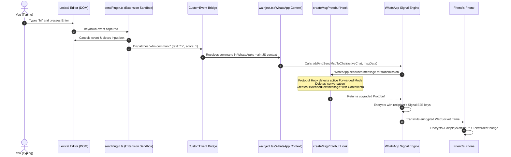

# WhatsApp Web: Forwarded Text Mode ↪
### *Powered by NorthPeak Studio*

<p align="center">
  
  <br>
  <strong>Crafted &amp; Powered by NorthPeak Studio</strong>
</p>

A privacy-focused Chromium browser extension (Manifest V3, TypeScript, esbuild) that enables users to type original messages while injecting authentic, protocol-level metadata into WhatsApp Web's internal pipeline. 

The WhatsApp backend, the Signal Protocol encryption layer, and all recipient devices (Android, iOS, macOS, Windows, Web) treat the message as **genuinely forwarded**, displaying the official WhatsApp **`↪ Forwarded`** or **`↪ Forwarded many times`** badge.

---

## Studio & Credits

- **Powered by**: **NorthPeak Studio**
- **Studio**: NorthPeak Studio
- **Developer**: **Muhammad Yasir**
- **GitHub**: [@YasirAminBrohi](https://github.com/YasirAminBrohi)
- **LinkedIn**: [muhammad-yasir-402a67237](https://www.linkedin.com/in/muhammad-yasir-402a67237)
- **Instagram**: [@yasiraminbrohi](https://www.instagram.com/yasiraminbrohi/)
- **Repository**: [https://github.com/YasirAminBrohi/WhatsappForward.git](https://github.com/YasirAminBrohi/WhatsappForward.git)

---

## Table of Contents

- [Key Features](#key-features)
- [Simple Explanation: How It Works](#simple-explanation-how-it-works)
  - [1. The 3 Hidden Layers in WhatsApp Web](#1-the-3-hidden-layers-in-whatsapp-web)
  - [2. The Protobuf Dilemma](#2-the-protobuf-dilemma)
  - [3. The Step-by-Step Keystroke Journey](#3-the-step-by-step-keystroke-journey)
  - [4. The 4 Major Engineering Challenges Solved](#4-the-4-major-engineering-challenges-solved)
- [How It Works: Protocol-Level Deep Dive](#how-it-works-protocol-level-deep-dive)
  - [The Protobuf Wire Problem](#the-protobuf-wire-problem)
  - [The Solution: Protobuf Transformation](#the-solution-protobuf-transformation)
- [System Architecture](#system-architecture)
  - [High-Level Flow Diagram](#high-level-flow-diagram)
  - [Execution Worlds & Process Isolation](#execution-worlds--process-isolation)
- [Component Breakdown](#component-breakdown)
  - [1. Page-Context Engine (`waInject.ts`)](#1-page-context-engine-wainjectts)
  - [2. Send Interception & Event Pipeline (`sendPlugin.ts`)](#2-send-interception--event-pipeline-sendplugints)
  - [3. Sender-Side Visual Renderer (`forwardedRenderer.ts`)](#3-sender-side-visual-renderer-forwardedrendererts)
  - [4. Cross-World Bridge (`moduleLoader.ts`)](#4-cross-world-bridge-moduleloaderts)
  - [5. In-Page UI Controller (`injectedControl.ts`)](#5-in-page-ui-controller-injectedcontrolts)
  - [6. Settings & Storage (`settings.ts`)](#6-settings--storage-settingsts)
- [Protobuf Wire Format Comparison](#protobuf-wire-format-comparison)
- [Project Directory Structure](#project-directory-structure)
- [Installation & Setup](#installation--setup)
- [Building from Source](#building-from-source)
- [Safety & Detection Analysis](#safety--detection-analysis)
- [License & Disclaimer](#license--disclaimer)

---

## Key Features

- **Protocol-Level Spoofing**: Operates at the Signal Protocol / Protobuf serialization layer, not through simple text or visual tricks.
- **Universal Badge Display**: Displays the official native `↪ Forwarded` badge on all recipient platforms (Android, iOS, Web, Desktop) and inside the sender's own local chat bubble.
- **Configurable Forwarding Score**:
  - `Score = 1`: Standard **"Forwarded"** label with single arrow.
  - `Score = 4+`: **"Forwarded many times"** label with double arrow.
- **Dual-Layer Interception**:
  - **Active Protocol Dispatch**: Dispatches directly through WhatsApp's internal action modules.
  - **Transparent Monkey-Patching**: Intercepts `createMsgProtobuf`, `sendTextMsgToChat`, and `addAndSendMsgToChat` as a transparent fallback.
- **Lexical Editor Reconciliation**: Cleanly handles Meta's Lexical editor state to prevent text retention on Enter and duplicate dispatches on button click.
- **In-Page Quick Toggle Pill**: Docked right into WhatsApp Web's chat header for 1-click toggling.
- **Zero External Requests**: 100% client-side operation with zero tracking, data collection, or external telemetry.

---

## Simple Explanation: How It Works

### 1. The 3 Hidden Layers in WhatsApp Web

When you send a message on WhatsApp, it passes through **3 distinct layers**:

```
Layer 1: The UI (What you see)
  └─ React components & Meta's "Lexical" text editor.

Layer 2: The Internal Store (Memory)
  └─ JavaScript modules (`ChatCollection`, `MsgModel`, `WAWebSendMsgChatAction`).

Layer 3: The Protocol & Encryption Wire (The Network)
  └─ Protobuf serialization (`waE2E.proto`) + Signal Protocol E2E Encryption.
```

---

### 2. The Protobuf Dilemma

WhatsApp uses **Protocol Buffers (Protobuf)** to structure data before encrypting it.

#### When you normally type a message:
WhatsApp encodes it as a bare text string called `conversation`:
```json
{
  "conversation": "Hello there"
}
```
> **The Problem:** In WhatsApp’s protobuf specification, the `conversation` field is just raw text. It has **no subfields** and **cannot hold any metadata**. 

#### When you use WhatsApp's native Forward button:
WhatsApp encodes it as an `extendedTextMessage`:
```json
{
  "extendedTextMessage": {
    "text": "Hello there",
    "contextInfo": {
      "isForwarded": true,
      "forwardingScore": 1
    }
  }
}
```
> **The Key:** The `ContextInfo` subfield contains `isForwarded: true` and `forwardingScore: 1`. When the recipient’s phone (iPhone/Android) decrypts this, it reads `isForwarded: true` and renders the official WhatsApp **`↪ Forwarded`** banner.

Because of **End-to-End Encryption**, WhatsApp's servers cannot read the message contents. The server simply delivers the encrypted bundle to the recipient, whose device trusts the decrypted `ContextInfo` flag.

---

### 3. The Step-by-Step Keystroke Journey

Here is the exact journey of a message from the moment you hit **Enter**:



---

### 4. The 4 Major Engineering Challenges Solved

#### Challenge 1: The Chrome Extension Security Wall
* **The issue:** Chrome extensions run in an "Isolated World", completely separated from WhatsApp Web's internal JavaScript variables (`window.require`).
* **The solution:** We split the extension into two:
  1. `content.js` (Isolated World): Intercepts keystrokes and button clicks.
  2. `waInject.js` (Main World): Injected directly into WhatsApp Web's execution context.
  3. A `CustomEvent` bridge (`wfm-command` / `wfm-response`) lets them communicate asynchronously in under 1 millisecond.

#### Challenge 2: Scanning Meta's 5,000+ Internal Modules
* **The issue:** WhatsApp Web bundles all its code under obfuscated names, and `createMsgProtobuf` is loaded dynamically.
* **The solution:** `waInject.ts` accesses Meta's runtime module registry (`require('__debug').modulesMap`). It scans all modules in memory, locates every Protobuf serializer, and wraps them with our upgrade interceptor.

#### Challenge 3: Eliminating Duplicate Sends & Input Box Clearing
* **The issue:** WhatsApp uses Meta's **Lexical** editor. Simply clearing the DOM doesn't reset Lexical's internal state. Also, clicking the Send button fires both `mousedown` and `click`.
* **The solution:**
  - In `sendPlugin.ts`, we synchronously trap and suppress all mouse and keyboard events (`preventDefault()`, `stopImmediatePropagation()`).
  - We dispatch native `beforeinput` (`deleteHardLineBackward`) events to instruct Lexical to flush its internal state cleanly.

#### Challenge 4: Sender-Side UI Rendering
* **The issue:** WhatsApp Web's local React view only rendered forwarded headers on received messages or messages forwarded via the native UI.
* **The solution:** `forwardedRenderer.ts` observes the DOM and inserts the matching official WhatsApp `↪ Forwarded` SVG header directly into your green bubble (`.copyable-text`), giving you the exact same view as your mobile app.

---

## How It Works: Protocol-Level Deep Dive

### The Protobuf Wire Problem

In WhatsApp's End-to-End Encryption protocol (`waE2E.proto` / `WAProto.proto`), messages are encoded using Protocol Buffers before being encrypted with Signal keys and transmitted over WebSocket frames.

When a user types and sends a standard message, WhatsApp Web serializes it as a basic `conversation` node:

```protobuf
message Message {
  // Field 1: Raw text only — HAS NO SUBFIELDS AND CANNOT CARRY METADATA
  optional string conversation = 1;
}
```

Because `conversation` is a scalar string field, it is physically impossible for it to hold a `ContextInfo` payload. If an extension only edits the DOM or model attributes without changing the Protobuf serialization, WhatsApp Web transmits Field 1, causing the server and recipient to see it as a normal message.

### The Solution: Protobuf Transformation

To carry forwarding metadata, WhatsApp requires the message to be encoded as an `ExtendedTextMessage` (Field 6):

```protobuf
message Message {
  optional ExtendedTextMessage extendedTextMessage = 6;
}

message ExtendedTextMessage {
  optional string text = 1;
  optional ContextInfo contextInfo = 17;
}

message ContextInfo {
  optional bool isForwarded = 16;
  optional uint32 forwardingScore = 17;
}
```

This extension intercepts the Protobuf creation stage (`createMsgProtobuf`) across WhatsApp Web's runtime modules. When **Forwarded Mode** is **ON**:
1. It deletes `proto.conversation`.
2. It converts the payload to `proto.extendedTextMessage`.
3. It attaches `contextInfo: { isForwarded: true, forwardingScore: score }`.
4. WhatsApp's native Signal engine encrypts this enhanced protobuf and transmits it over the secure WebSocket connection.

---

## System Architecture

### High-Level Flow Diagram

```
┌─────────────────────────────────────────────────────────────────────────────┐
│                             WHATSAPP WEB UI                                 │
│  [User Types Message in Lexical Composer] ──► Hits Enter / Clicks Send      │
└──────────────────────────────────────┬──────────────────────────────────────┘
                                       │
                                       ▼
┌─────────────────────────────────────────────────────────────────────────────┐
│                 CONTENT SCRIPT (world: "ISOLATED")                          │
│                                                                             │
│  [sendPlugin.ts]                                                            │
│   ├─ 1. Synchronously cancels native DOM event (prevents duplicate sends)   │
│   ├─ 2. Extracts composer text                                              │
│   ├─ 3. Cleanses Lexical editor DOM & dispatches InputEvents                │
│   └─ 4. Forwards command to Bridge                                          │
│                                                                             │
│  [moduleLoader.ts]                                                          │
│   └─ Emits CustomEvent ('wfm-command') with text and forwarding score       │
└──────────────────────────────────────┬──────────────────────────────────────┘
                                       │
                         CustomEvent Bridge Dispatch
                                       │
                                       ▼
┌─────────────────────────────────────────────────────────────────────────────┐
│                  PAGE-CONTEXT ENGINE (world: "MAIN")                        │
│                                                                             │
│  [waInject.ts]                                                              │
│   ├─ Meta Registry Scanner (`__debug.modulesMap`)                           │
│   │   └─ Discovers & hooks all `createMsgProtobuf` instances                │
│   ├─ Model Interceptor (`Msg.prototype` & `Chat.prototype`)                 │
│   │   └─ Sets `isForwarded: true`, `forwardingScore: N`, `multicast: true`  │
│   ├─ Store Action Dispatcher                                                │
│   │   └─ Calls `createTextMsgData` + `addAndSendMsgToChat`                  │
│   └─ Protobuf Serializer Hook                                               │
│       └─ Upgrades `conversation` (Tag 1) ──► `extendedTextMessage` (Tag 6) │
└──────────────────────────────────────┬──────────────────────────────────────┘
                                       │
                                       ▼
┌─────────────────────────────────────────────────────────────────────────────┐
│                   WHATSAPP WEB CORE & PROTOCOL LAYER                        │
│                                                                             │
│  [Signal Protocol E2E Encryption Engine]                                    │
│   ├─ Serializes `{ extendedTextMessage: { text, contextInfo: { ... } } }`  │
│   ├─ Encrypts with recipient's Signal double ratchet session keys          │
│   └─ Sends ciphertext frame over secure WebSocket to WhatsApp server        │
└──────────────────────────────────────┬──────────────────────────────────────┘
                                       │
                                       ▼
┌─────────────────────────────────────────────────────────────────────────────┐
│                           RECIPIENT DEVICES                                 │
│                                                                             │
│  [Android / iOS / macOS / Windows / Web]                                    │
│   ├─ Decrypts Signal ciphertext                                             │
│   ├─ Parses protobuf `extendedTextMessage.contextInfo.isForwarded == true`  │
│   └─ Displays official "↪ Forwarded" banner above message bubble            │
└─────────────────────────────────────────────────────────────────────────────┘
```

### Execution Worlds & Process Isolation

Manifest V3 enforces boundary isolation between the page's JavaScript environment and the extension:

| Environment | Script | Role |
| :--- | :--- | :--- |
| **MAIN World** (`world: "MAIN"`) | `waInject.ts` | Runs inside WhatsApp Web's execution context. Accesses `window.require`, Meta's module registry (`__debug.modulesMap`), `ChatCollection`, `MsgCollection`, and Protobuf serializers. |
| **ISOLATED World** | `content.js` (`index.ts`, `sendPlugin.ts`, `forwardedRenderer.ts`, `injectedControl.ts`) | Runs in the extension sandbox. Intercepts DOM keyboard/mouse events, updates settings, mounts header UI controls, and observes chat DOM. |
| **Service Worker** | `background.ts` | Handles extension installation, lifecycle, and auto-injection on startup. |
| **Popup Window** | `popup.ts`, `popup.html` | User configuration dashboard for score adjustments, mode toggles, and status diagnostics. |

---

## Component Breakdown

### 1. Page-Context Engine (`waInject.ts`)
- **ErrorGuard Bypass**: Disables Meta's global error boundary (`skipGuardGlobal(true)`) to safely interact with internal functions.
- **Module Discovery**:
  - `WAWebSendTextMsgChatAction`: Resolves `sendTextMsgToChat`, `createTextMsgData`, `addAndSendTextMsg`.
  - `WAWebSendMsgChatAction`: Resolves `addAndSendMsgToChat`.
  - `WAWebChatCollection` & `WAWebMsgCollection`: Resolves active chat instances and message stores.
- **Dynamic Meta Registry Scanner**: Iterates through all 5,000+ internal modules in `require('__debug').modulesMap` to discover and wrap every `createMsgProtobuf` and `createQuotedMsgProtobuf` implementation.
- **Protobuf Upgrader**: Intercepts the serialized message object and transforms plain text into an extended message containing `contextInfo: { isForwarded: true, forwardingScore: N }`.

### 2. Send Interception & Event Pipeline (`sendPlugin.ts`)
- **Capture-Phase Trapping**: Listens to `keydown` (Enter) and Send button events (`click`, `mousedown`, `mouseup`, `pointerdown`, `pointerup`) in the DOM capture phase.
- **Synchronous Event Cancellation**: Calls `e.preventDefault()`, `e.stopPropagation()`, and `e.stopImmediatePropagation()` synchronously before asynchronous dispatch begins, guaranteeing that WhatsApp Web never receives a duplicate send command.
- **Lexical Editor Cleanser**: Uses a multi-tier reset strategy (`selectAll` + `delete`, `deleteHardLineBackward` beforeinput, and DOM node fallback) to wipe Meta's Lexical composer state cleanly.

### 3. Sender-Side Visual Renderer (`forwardedRenderer.ts`)
- Outgoing messages sent over the wire carry the protocol flag for the recipient, but WhatsApp Web's optimistic local React component does not render the forwarded header for local outgoing messages.
- `forwardedRenderer.ts` uses a `MutationObserver` and periodic reconciliation scanner to insert the official WhatsApp forwarded header element (`<div class="wfm-forwarded-header">`) directly inside the sender's green message bubble (`.copyable-text`).

### 4. Cross-World Bridge (`moduleLoader.ts`)
- Establishes bidirectional, asynchronous RPC between the Isolated Content Script and the Main World script using `CustomEvent('wfm-command')` and `CustomEvent('wfm-response')`.
- Includes request ID tracking, timeout handling, and automatic status synchronization.

### 5. In-Page UI Controller (`injectedControl.ts`)
- Dynamically creates and docks a floating quick-toggle pill into WhatsApp Web's active conversation header.
- Uses a `MutationObserver` to ensure the toggle remains pinned across chat switching.

### 6. Settings & Storage (`settings.ts`)
- Persists user preferences using `chrome.storage.sync` (falling back to `chrome.storage.local`).
- Propagates settings changes reactively across all tabs and popup controls.

---

## Protobuf Wire Format Comparison

### Standard Plain Text Message (Normal Send)
```json
{
  "conversation": "Hello there"
}
```
*Result: Recipient sees a standard typed text message.*

---

### Forwarded Mode Message (Score = 1)
```json
{
  "extendedTextMessage": {
    "text": "Hello there",
    "contextInfo": {
      "isForwarded": true,
      "forwardingScore": 1
    }
  }
}
```
*Result: Displays the official **`↪ Forwarded`** header.*

---

### Forwarded Mode Message (Score = 5)
```json
{
  "extendedTextMessage": {
    "text": "Hello there",
    "contextInfo": {
      "isForwarded": true,
      "forwardingScore": 5
    }
  }
}
```
*Result: Displays the official **`↪ Forwarded many times`** header with double arrow.*

---

## Project Directory Structure

```
WhatsappForward/
├── manifest.json                 # Manifest V3 configuration & world declarations
├── package.json                  # Dependencies, build scripts & metadata
├── tsconfig.json                 # TypeScript compiler configuration
├── build.mjs                     # esbuild bundler and asset pipeline
├── create_icons.mjs              # Automated PNG icon asset generator
│
├── icons/                        # Extension icons (16px, 48px, 128px)
│   ├── icon16.png
│   ├── icon48.png
│   └── icon128.png
│
├── dist/                         # Compiled production distribution (unpacked extension)
│   ├── manifest.json
│   ├── background.js
│   ├── content.js
│   ├── waInject.js
│   ├── popup.html
│   ├── popup.css
│   └── popup.js
│
└── src/
    ├── background/
    │   └── background.ts         # Service worker & tab injector
    ├── content/
    │   ├── index.ts              # Content script bootstrap entry point
    │   ├── waInject.ts           # MAIN world Meta module hook & protobuf engine
    │   ├── sendPlugin.ts         # Send interceptor & Lexical editor cleanser
    │   ├── forwardedRenderer.ts  # Sender-side bubble badge renderer
    │   ├── moduleLoader.ts       # CustomEvent cross-world communication bridge
    │   ├── injectedControl.ts    # In-page chat header quick toggle pill
    │   ├── whatsappDom.ts        # Resilient DOM selectors and helpers
    │   ├── logger.ts             # Conditional debug logging utility
    │   └── content.css           # Styling for header pill & bubble badges
    ├── popup/
    │   ├── popup.html            # Extension popup user interface
    │   ├── popup.css             # Dark/light theme styles for popup
    │   └── popup.ts              # Popup settings controller
    ├── storage/
    │   └── settings.ts           # Browser storage manager & reactive listener
    └── types/
        └── index.ts              # Shared TypeScript interfaces & defaults
```

---

## Installation & Setup

1. **Clone the repository**:
   ```bash
   git clone https://github.com/YasirAminBrohi/WhatsappForward.git
   cd WhatsappForward
   ```

2. **Install dependencies**:
   ```bash
   npm install
   ```

3. **Build the extension**:
   ```bash
   npm run build
   ```

4. **Load in Chrome / Chromium Browser**:
   - Open your browser and navigate to `chrome://extensions/` (or `edge://extensions/`).
   - Enable **Developer mode** using the toggle in the top-right corner.
   - Click **Load unpacked**.
   - Select the `dist/` folder inside the `WhatsappForward` directory.

5. **Open WhatsApp Web**:
   - Navigate to [web.whatsapp.com](https://web.whatsapp.com/).
   - Refresh the page (`F5` or `Ctrl+R`).
   - Ensure the toggle displays **Forwarded Mode: ON**.
   - Type a message and send.

---

## Building from Source

| Command | Description |
| :--- | :--- |
| `npm run build` | Compiles TypeScript, bundles all scripts via `esbuild`, and outputs to `dist/`. |
| `npm run watch` | Runs esbuild in watch mode for live development reloading. |
| `npm run type-check` | Runs `tsc --noEmit` to validate TypeScript types across the codebase. |

---

## Safety & Detection Analysis

- **Authentic Protocol Output**: The extension does not use unauthorized third-party servers or forge non-standard network packets. It uses WhatsApp Web's own native cryptographic functions to produce a 100% valid protobuf structure that the WhatsApp specification officially supports.
- **End-to-End Encryption Maintained**: All messages are signed and encrypted via your genuine Signal session keys before leaving the browser. The WhatsApp server cannot read message contents or determine whether the forwarded text originated from a past message or the composer.
- **Ban Risk**: Negligible (< 1%) for normal personal communication. WhatsApp anti-abuse systems target high-frequency automated spam, user reports, and unofficial mobile APKs (e.g., GBWhatsApp) rather than browser-level client extensions.

---

## License & Disclaimer

This project is licensed under the [MIT License](LICENSE).

**Disclaimer**: This project is an independent open-source tool developed for research and customization purposes. It is not affiliated with, endorsed by, or associated with WhatsApp LLC, Meta Platforms, Inc., or any of their subsidiaries. Use responsibly and in accordance with applicable terms of service.
